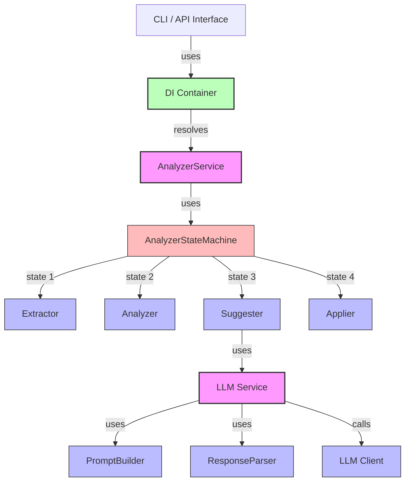
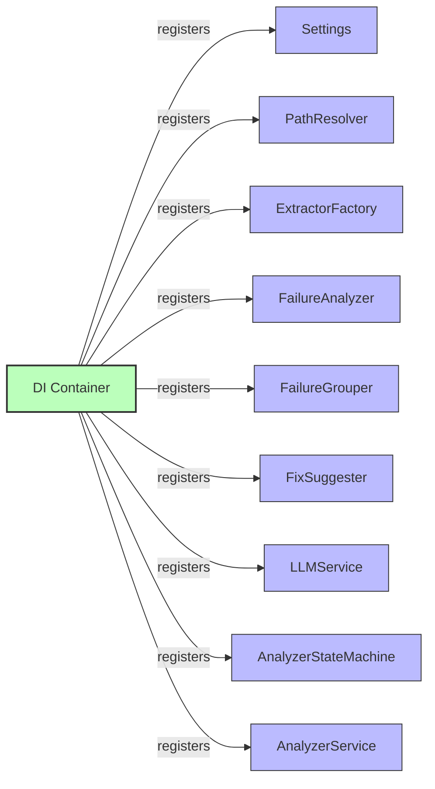
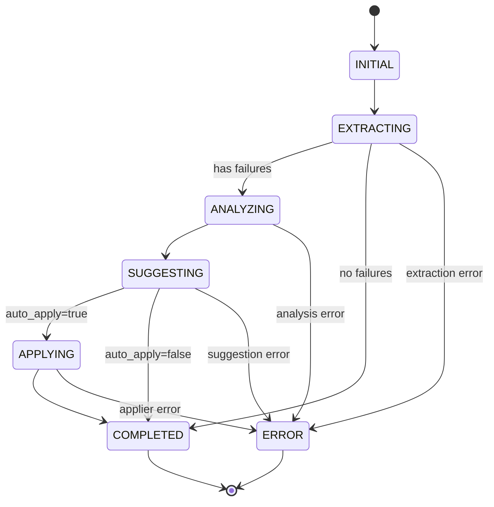
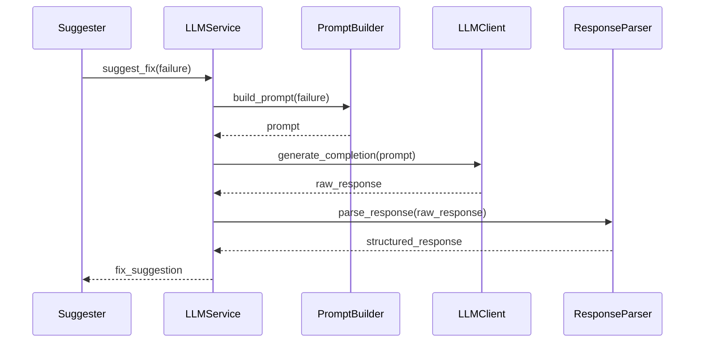
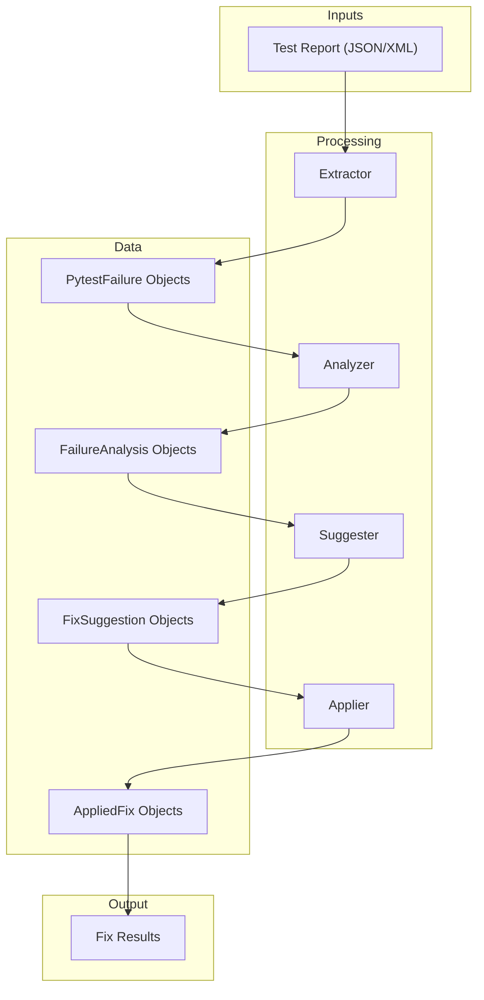

# Component Diagram for Pytest Analyzer

## Main Component Diagram

```mermaid
graph TB
    CLI["CLI / API Interface"]
    AS["AnalyzerService"]
    DI["DI Container"]
    ASM["AnalyzerStateMachine"]
    EXT["Extractor"]
    ANA["Analyzer"]
    SUG["Suggester"]
    APP["Applier"]
    LLMS["LLM Service"]
    PB["PromptBuilder"]
    RP["ResponseParser"]
    LC["LLM Client"]

    CLI -->|uses| DI
    DI -->|resolves| AS
    AS -->|uses| ASM
    ASM -->|state 1| EXT
    ASM -->|state 2| ANA
    ASM -->|state 3| SUG
    ASM -->|state 4| APP
    SUG -->|uses| LLMS
    LLMS -->|uses| PB
    LLMS -->|uses| RP
    LLMS -->|calls| LC

    classDef service fill:#f9f,stroke:#333,stroke-width:2px;
    classDef component fill:#bbf,stroke:#333,stroke-width:1px;
    classDef container fill:#bfb,stroke:#333,stroke-width:2px;
    classDef machine fill:#fbb,stroke:#333,stroke-width:1px;

    class DI container;
    class AS,LLMS service;
    class EXT,ANA,SUG,APP,PB,RP,LC component;
    class ASM machine;
```

## Dependency Injection Container

```mermaid
graph LR
    DI["DI Container"]
    SET["Settings"]
    PR["PathResolver"]
    EF["ExtractorFactory"]
    FA["FailureAnalyzer"]
    FG["FailureGrouper"]
    FS["FixSuggester"]
    LS["LLMService"]
    AS["AnalyzerService"]
    ASM["AnalyzerStateMachine"]

    DI -->|registers| SET
    DI -->|registers| PR
    DI -->|registers| EF
    DI -->|registers| FA
    DI -->|registers| FG
    DI -->|registers| FS
    DI -->|registers| LS
    DI -->|registers| ASM
    DI -->|registers| AS

    classDef container fill:#bfb,stroke:#333,stroke-width:2px;
    classDef component fill:#bbf,stroke:#333,stroke-width:1px;

    class DI container;
    class SET,PR,EF,FA,FG,FS,LS,ASM,AS component;
```

## State Machine Workflow

```mermaid
stateDiagram-v2
    [*] --> INITIAL
    INITIAL --> EXTRACTING
    EXTRACTING --> ANALYZING: has failures
    EXTRACTING --> COMPLETED: no failures
    ANALYZING --> SUGGESTING
    SUGGESTING --> APPLYING: auto_apply=true
    SUGGESTING --> COMPLETED: auto_apply=false
    APPLYING --> COMPLETED

    EXTRACTING --> ERROR: extraction error
    ANALYZING --> ERROR: analysis error
    SUGGESTING --> ERROR: suggestion error
    APPLYING --> ERROR: applier error

    COMPLETED --> [*]
    ERROR --> [*]
```

## LLM Service Workflow

```mermaid
sequenceDiagram
    participant Suggester
    participant LLMService
    participant PromptBuilder
    participant LLMClient
    participant ResponseParser

    Suggester->>LLMService: suggest_fix(failure)
    LLMService->>PromptBuilder: build_prompt(failure)
    PromptBuilder-->>LLMService: prompt
    LLMService->>LLMClient: generate_completion(prompt)
    LLMClient-->>LLMService: raw_response
    LLMService->>ResponseParser: parse_response(raw_response)
    ResponseParser-->>LLMService: structured_response
    LLMService-->>Suggester: fix_suggestion
```

## Data Flow Diagram

```mermaid
flowchart TD
    subgraph Inputs
        Report["Test Report (JSON/XML)"]
    end

    subgraph Processing
        EXT["Extractor"]
        ANA["Analyzer"]
        SUG["Suggester"]
        APP["Applier"]
    end

    subgraph Data
        PF["PytestFailure Objects"]
        FA["FailureAnalysis Objects"]
        FS["FixSuggestion Objects"]
        AF["AppliedFix Objects"]
    end

    subgraph Output
        FR["Fix Results"]
    end

    Report --> EXT
    EXT --> PF
    PF --> ANA
    ANA --> FA
    FA --> SUG
    SUG --> FS
    FS --> APP
    APP --> AF
    AF --> FR
```
