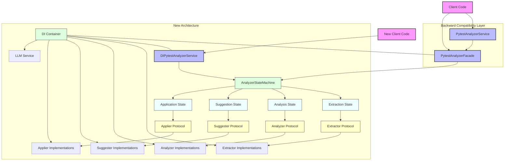

# Facade Component Diagram

## Overview

The following component diagram illustrates the role of the facade within the pytest-analyzer's architecture. It shows how the facade provides backward compatibility with the legacy API while leveraging the new architecture components.

## Component Diagram

## Key Components

### Client Layer
- **Client Code**: Existing code using the legacy API
- **New Client Code**: New code using the DI-based API
- **PytestAnalyzerService**: Legacy class name that inherits from the facade
- **PytestAnalyzerFacade**: Facade implementation that provides backward compatibility
- **DIPytestAnalyzerService**: New service that directly uses the DI container

### Architecture Layer
- **DI Container**: Manages dependencies and component instantiation
- **AnalyzerStateMachine**: Coordinates the analysis workflow

### Protocol Layer
- **Extractor Protocol**: Interface for extracting test failures
- **Analyzer Protocol**: Interface for analyzing failures
- **Suggester Protocol**: Interface for suggesting fixes
- **Applier Protocol**: Interface for applying fixes

### Implementation Layer
- **Extractor Implementations**: Concrete extractor classes
- **Analyzer Implementations**: Concrete analyzer classes
- **Suggester Implementations**: Concrete suggester classes
- **Applier Implementations**: Concrete applier classes
- **LLM Service**: Language model service for AI-based suggestions

## Flow of Control

1. Client code interacts with either the legacy service, facade, or DI-based service
2. The facade delegates to the state machine
3. The state machine coordinates the workflow through various states
4. Each state interacts with the appropriate protocol
5. Protocols are implemented by concrete implementations
6. The DI container manages the instantiation and configuration of all components

This architecture provides a clean migration path from the legacy API to the new architecture while maintaining backward compatibility.
